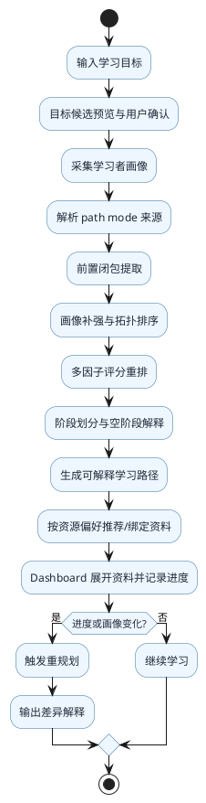
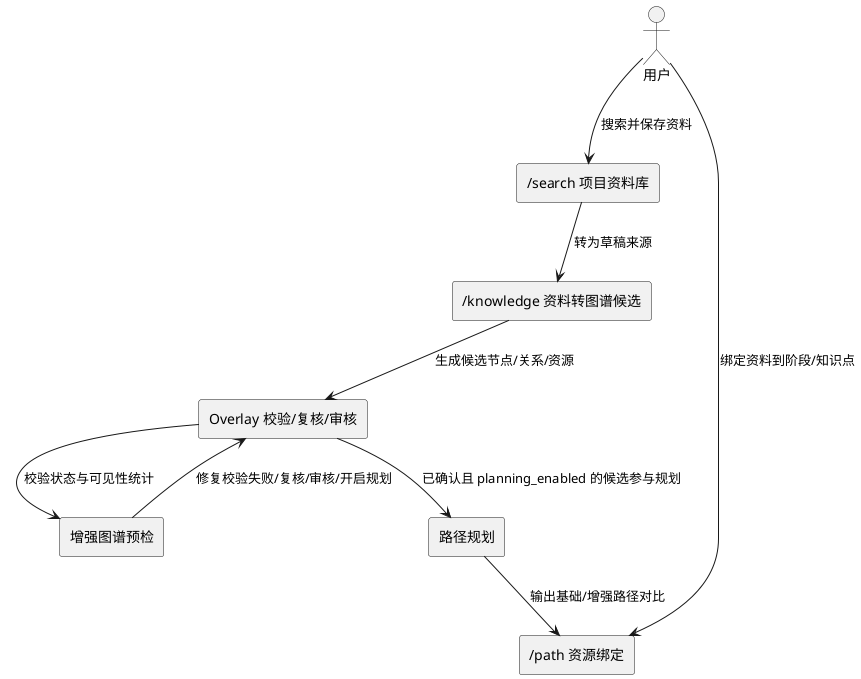

# 论文与答辩精炼说明稿

## 1. 项目一句话定义

LearnPath-KG 是一个面向“机器学习基础”学习场景的单领域知识图谱学习路径规划系统原型。系统以知识图谱表达知识点及其前置依赖关系，结合学习者画像、时间预算与学习进度，生成可解释、可追踪、可重规划的学习路径。

## 2. 项目到底做了什么

本项目完成了一条从“学习目标输入”到“学习路径输出与动态调整”的可运行闭环，主要包括：

1. 学习项目创建与目标录入
2. 学习者画像采集与参数化建模
3. 基于知识图谱的路径生成
4. 路径解释结果展示
5. 知识图谱查看、节点/边审核与项目级可审核扩展
6. 学习进度追踪
7. 基于进度或画像变化的重规划
8. 在线学习资料搜索与结果展示
9. 路径后增强式资源补充与手动绑定
10. 运行时配置管理与健康检查

## 3. 已实现的核心功能

### 3.1 学习目标建模
系统支持三类目标输入：
- 领域型：如“我想系统学习机器学习基础”
- 概念型：如“理解梯度下降”
- 问题型：如“逻辑回归为什么能做分类”

创建项目时，系统先执行目标预览，生成可解释候选并推荐最匹配候选；用户确认候选后才创建项目或重新确认项目目标。若没有可确认候选，接口会返回 `422 EMPTY_CANDIDATES`，并给出稳定的 `reason_code` 与可读 `reason_text`，便于用户改写目标。

### 3.2 学习者画像建模
系统采集并使用以下画像参数：
- 数学基础
- 编程基础
- 机器学习基础
- 理论/实践偏好
- 每周可投入时间
- 学习周期预算
- 路径模式偏好
- 学习目标取向
- 资源偏好
- 练习强度期望

其中数学、编程、机器学习基础、理论/实践偏好、每周时间与周期预算是规划权威输入；路径模式偏好会参与首次路径模式解析，资源偏好会影响资源搜索提示、偏好标记与轻量排序，练习强度会影响前端学习行动建议。目标取向、persona 标签、摘要和证据主要用于展示、解释、审计和报告。

当前支持两种采集方式：
- LLM 在线澄清问答
- 静态问卷（用于本地演示与边界说明）

### 3.3 路径规划
系统能够根据目标知识点、前置依赖关系和学习者画像，生成阶段化学习路径，并输出：
- 各阶段任务列表
- 任务顺序
- 总学时估计
- 时间预算状态

### 3.4 解释机制
系统不仅给出路径结果，还能解释：
- 为什么选择这些知识点
- 为什么按这个顺序学习
- 为什么这样分阶段
- 时间预算是否可行
- 依赖链如何影响最终结果

### 3.5 图谱审核、项目级扩展与重规划
系统支持对 baseline 节点和边进行审核，并通过 `removed` 状态影响后续路径生成。在此基础上，系统增加了项目级 overlay 扩展能力：用户可以从粘贴文本或已保存搜索结果创建候选知识点、关系和资源，经过校验、去重、人工审核与 planning 开关控制后，作为项目图谱的一部分参与规划。

这里需要明确答辩口径：overlay 是“机器学习单领域原型中的项目级可审核扩展”，不是已经开放的通用自动建图平台。SQLite 保存 overlay 真源，Neo4j 只做展示投影；即使 projection status 出现 `missing|drifted|error` 或推广失败，项目级草稿仍可恢复。baseline 审核只允许 `pending|confirmed|removed`，overlay 审核额外允许 `rejected`；review action 与 planning toggle 分离，避免审核动作隐式改变规划开关。

重规划支持两种模式：
- `progress_aware`：保留已完成部分，只重算剩余路径
- `profile_update`：画像变化后重新生成完整路径

### 3.6 搜索、资源增强与演示辅助能力
系统支持在线搜索学习资料，并在学习路径生成后围绕路径中的知识点自动补充候选资源；阶段资源仅作为总览保底。搜索结果还可保存为项目级 persisted search result，经 bridge 幂等转换为 overlay `search_url` source 后进入 Knowledge 抽取流程。LLM extraction preview 只生成可审阅 payload；资源 candidate 与 binding 只影响资源展示和 promotion 资格，不进入路径规划图；这能说明系统把“资料增强”和“路径正确性”做了隔离。同时系统提供运行时配置页面、健康检查接口和分层 readiness 预检能力，便于答辩现场联调与演示。

## 4. 用到了什么算法与方法

本项目的核心不是黑盒推荐，而是“知识图谱 + 规则 + 图算法”的可解释规划方案，主要使用：

1. **知识图谱建模**
   - 用节点表示知识点
   - 用 `REQUIRES` 表示前置依赖
   - 用 `RELATED_TO` 表示语义关联

2. **前置闭包提取**
   - 对目标知识点递归追溯其所有必要前置知识点
   - 形成满足学习条件的候选子图

3. **DAG 校验与拓扑排序**
   - 在依赖约束下生成合法学习顺序
   - 保证后学内容不会先于前置内容出现

4. **多因子评分重排**
   - 综合目标相关性、知识点重要度、难度、画像差距、偏好等因素进行排序
   - 在满足依赖关系前提下实现个性化路径调整

5. **阶段划分与路径模式**
   - 按阶段规则将任务划分为基础准备、核心掌握、应用提升等阶段
   - 支持标准、压缩、理论优先和实践优先模式，但不破坏硬依赖顺序

6. **预算评估**
   - 根据总学时、每周可投入时间和截止周期，计算预算状态
   - 输出 feasible / tight / insufficient 等结果
   - 压缩模式下如果必要前置闭包已经超预算，会提示 over_budget_required_closure，而不是裁剪硬依赖

7. **差异比较与重规划**
   - 比较旧路径与新路径的增删改变化
   - 对已完成、待处理、跳过部分做可视化呈现

## 5. 路径生成原理

可以将路径生成理解为以下过程：

1. 对用户目标执行 preview，生成目标候选并要求用户确认候选
2. 从已确认候选中获得核心目标知识点
3. 根据知识图谱向前追溯所有必要前置知识点
4. 结合学习者画像判断哪些基础知识需要补强
5. 在满足依赖关系的前提下进行拓扑排序
6. 再用多因子评分对候选顺序进行个性化重排
7. 将结果划分为阶段并计算总学时与预算状态
8. 输出结构化学习路径与解释信息

因此，系统生成的不是“任意推荐列表”，而是一个满足依赖约束、考虑个体差异、具备可解释性的学习序列。

## 6. 从输入到输出的完整流程

完整流程如下：

```text
学习目标输入
→ 目标候选预览
→ 用户选择候选并确认目标节点
→ 学习者画像采集
→ 前置闭包提取
→ 候选子图构建
→ 拓扑排序
→ 多因子评分重排
→ 阶段划分
→ 时间预算评估
→ 输出学习路径与解释
→ 按阶段补充候选学习资源
→ 记录学习进度
→ 触发重规划
```

推荐主演示路线可以收敛为：

```text
设置页 readiness 预检
→ 创建“机器学习基础”项目并生成基础路径
→ 展示解释、预算、Path 到 Knowledge 节点定位
→ 创建“逻辑回归为什么能做分类”问题型目标作对照
→ 输入“我想学习随机森林”展示 in_domain_uncovered / review_extension_draft
→ Search 保存资料或 Knowledge 粘贴资料
→ 在 Knowledge 的“项目扩展会话”中确认扩展主题和约束
→ LLM 生成 overlay extraction payload 预览；若 LLM 暂不可用，展示“资料已保存，可稍后重试抽取或手动补充”的降级路径
→ 复用 extraction session 校验，展示候选诊断、批量确认与批量纳入 planning_enabled
→ 从 Knowledge 预检入口进入 Path 图谱方案对比，显式生成基础 / enhanced 路径预览
→ Dashboard 记录进度并触发 progress_aware / profile_update 重规划
```

不建议在主答辩演示中直接执行 promotion commit；如评委追问，可展示 promotion preview 的 no-write 校验、pack hash 与 lineage 设计，说明正式领域包推广仍需要额外审批。

## 7. 本项目的创新点应该如何表述

对于本科毕业设计，建议将创新点写为“系统设计特色与实现创新”，而不是夸大为理论突破。较稳妥的写法包括：

1. 将知识图谱引入学习路径规划问题，显式表示知识点依赖关系
2. 将拓扑排序与画像驱动多因子评分结合，实现“约束正确 + 个性化”的路径生成
3. 增加解释模块，使路径结果具有可理解性和可追溯性
4. 引入进度感知重规划，使系统具备动态调整能力
5. 采用“规则图算法主链 + LLM/search 在线增强”的分层机制，在不破坏主链稳定性的前提下补充候选学习资料与项目级草稿
6. 引入项目级可审核 overlay，把外部资料抽取结果限定在项目范围内，经校验和人工确认后才影响规划
7. 构建了从目标输入到路径输出再到进度反馈的闭环原型系统

## 8. 项目实现是否合理

从本科毕设视角看，当前实现是合理的，原因在于：

1. 目标明确：聚焦单一领域，避免范围过大
2. 方法清晰：图结构与规则驱动，逻辑可解释
3. 工程闭环完整：前后端、数据层、图谱展示、路径规划、进度跟踪、重规划均已打通
4. 可验证性较强：已有测试与验证资产支撑核心功能
5. 可答辩性较好：功能链路完整，演示流程清晰，叙事可收敛

当前答辩口径建议明确强调：
- 当前是机器学习基础单领域原型，不是已开放多领域平台；registry/contract 是为了收口框架边界与未来扩展点
- Domain Pack JSON 是正式规划事实源，负责保存知识节点、硬前置依赖、阶段规则和资源基础数据
- Neo4j 是图谱展示与审核 projection，不作为正式路径正确性的最终事实源
- LLM/Search 是目标理解、解释润色、资料搜索和 overlay 候选抽取的增强能力，不直接决定正式路径正确性
- 目标解析采用“预览候选 + 用户确认”的可解释流程，而不是黑盒直接创建
- `GET /health/readiness` 已区分 `core_ready`、`demo_ready`、`enhanced_ready`
- 这意味着可以把“规则图算法主链可演示”和“在线增强是否就绪”分开表达
- `services.graph_sync` 直接说明 Neo4j 图谱是否与当前 Domain Pack 同步
- 论文验证脚本与摘要指标已经把上述口径写入结构化证据
- 实验结论只说明当前单领域原型的结构正确性、可解释性和工程可复现性，不外推为真实学习效果提升
- 领域型目标默认覆盖完整机器学习基础主干，不强调节点集合层面的个性化；个性化重点放在概念型/问题型、排序解释、预算提示和资源推荐

## 9. 功能模块与题目是否相符

整体上是相符的。

论文题目强调“基于知识图谱的智能学习路径规划系统设计与实现”，当前系统的主链确实围绕：
- 知识图谱表示
- 学习目标解析
- 路径规划
- 解释与重规划
- 系统实现与展示

需要注意的是：
- 当前版本是“机器学习基础单领域原型”
- 搜索能力属于辅助增强，不宜写成主规划事实来源
- 图谱审核与 overlay 是项目级可审核扩展，不宜表述为跨领域通用自动建图平台

## 10. 当前仍存在的问题

1. 当前仅支持 `machine_learning` 单领域，通用性有限
2. 搜索结果主要用于在线展示和项目级扩展来源，正式提升为 Domain Pack 仍需要受控 promotion
3. 图谱审核与 overlay 写入范围仍限定在当前机器学习单领域原型内
4. LLM 与在线搜索依赖外部服务，完整增强演示需要提前完成运行时配置
5. 当前资源增强已支持阶段级自动补充与手动绑定，但资源质量评估与节点级精细排序仍较弱
6. 多领域扩展、自动建图、资源排序等仍处于后续拓展方向

答辩时建议主动说明：
- `demo_ready=true` 代表规则图算法主链、图谱展示、解释、进度与重规划可演示
- `enhanced_ready=true` 才代表 LLM 目标理解、画像问卷、overlay 抽取预览与在线搜索可完整演示
- 前端保留 `normalizeReadiness`，是为了兼容旧联调实例，不代表当前代码仍停留在旧 readiness 语义
- `tracking/summary` 已切换到 `latest plan` 口径，更符合重规划后的学习状态解释
- 项目页工作流总览会给出下一步推荐理由、阻塞项和跳转目标，可作为现场串联“目标确认 → 画像 → 图谱扩展 → 路径 → 跟踪”的讲解入口
- overlay 抽取已支持来源上下文截断提示、短暂 LLM 请求重试和中文错误建议；答辩时可把它解释为增强链路的稳定性保护，而不是路径规划正确性的前提

## 11. 写论文与答辩时的不足和缺陷

在论文与答辩中，需要主动承认以下边界：

1. 这是单领域原型，不是通用教育平台
2. 当前主要验证的是“路径规划闭环可行性”，不是大规模教学平台可运营性
3. 搜索与 LLM 是增强能力，不应夸大为系统核心依赖
4. 图谱审核、overlay projection/promotion 与知识更新机制仍限定在机器学习单领域原型内，当前更适合作为项目级可审核扩展原型
5. 创新点更偏系统集成与可解释实现，而不是新算法理论突破

## 12. 后续改进方向

1. 扩展更多领域知识包，验证跨领域泛化能力
2. 增强知识点抽取与自动建图流程
3. 增加资源质量评估与个性化资源排序
4. 强化图谱审核交互与审核依据展示
5. 完善重规划差异解释与可视化能力
6. 建立更系统的实验评价指标与用户验证方案

## 13. 可直接用于答辩的总结表述

本项目设计并实现了一个面向机器学习基础学习场景的知识图谱学习路径规划系统原型。系统以知识图谱表达知识点及其前置依赖关系，以学习者画像描述用户基础与偏好，再结合前置闭包提取、拓扑排序、多因子评分和阶段划分等方法，生成个性化、可解释的学习路径。系统还支持学习进度跟踪、路径重规划、图谱审核、项目级可审核扩展、在线资料搜索以及路径后增强式资源补充，完成了从目标输入到路径输出再到动态调整的完整闭环。

在当前版本中，答辩前预检被拆分为分层状态：`demo_ready` 代表 SQLite、Neo4j、图谱同步与规则图算法主链已满足核心演示要求，`enhanced_ready` 代表 LLM 与在线搜索等增强能力是否就绪。这样可以清楚说明：核心主链可独立证明路径规划正确性，完整增强演示则需要提前连通 LLM 与搜索配置。当前实现作为单领域本科毕业设计原型，具有较好的可实现性、可验证性和可答辩性。

## 14. 画像字段作用与资源闭环补充

### 14.1 画像字段作用表

| 画像字段 | 用户语义 | 主要作用位置 | 答辩解释口径 |
|---|---|---|---|
| `math_level` / `coding_level` / `ml_level` | 学习者基础能力 | 补强节点选择、排序评分、画像摘要 | 用于判断是否需要补齐数学、编程或机器学习基础 |
| `theory_weight` / `practice_weight` | 理论理解与案例上手的排序偏好 | 路径排序和 persona 描述 | 表达学习方式倾向，不再承担路径长短语义 |
| `path_mode_preference` | 路径完整度：标准或压缩 | 首次路径生成的 path mode 解析；审计中记录 `path_mode_source` | 用户希望完整学还是压缩学，系统按显式请求、项目设置、画像偏好、默认值依次决策 |
| `weekly_hours` / `deadline_weeks` | 每周投入和周期预算 | 时间预算评估、路径可行性提示 | 系统不裁剪必要前置，而是说明预算是否紧张 |
| `resource_preference` | 偏好的资料形态：图文、视频、代码、论文或混合 | 资源搜索 query hint、`preference_match` 标记、轻量分数提升 | 资料偏好影响资源推荐呈现，但不会过滤掉仍相关的非偏好资料 |
| `practice_intensity` | 每阶段练习密度 | Path 阶段提示、任务卡行动建议、资源 CTA | 练习密度影响学习执行建议，不硬塞无关知识点 |
| `learning_goal_orientation` | 学习目标取向：基础、考试、项目、科研、求职 | persona 标签、摘要、审计和展示 | 用于解释学习者画像，不替代图谱依赖约束 |

### 14.2 主链路闭环图（PlantUML）



### 14.3 资料与 Overlay 增强闭环图（PlantUML）



### 14.4 空阶段解释口径

当“核心掌握”或“应用突破”等阶段为空时，不应解释为系统失败，而应解释为：当前目标范围和知识图谱依赖闭包下没有匹配到该阶段节点。系统选择展示 `empty_reason`，而不是为了页面完整性加入无关知识点。这体现了知识图谱路径规划的约束优先原则。

可直接用于答辩的表述：

> 系统不会为了填满阶段而伪造学习任务。若某阶段为空，说明当前目标闭包没有匹配节点；前端会展示空阶段原因，保证路径结果服从图谱依赖和目标范围，而不是服从页面版式。

### 14.5 推荐演示样例

#### 样例 A：标准主链路

| 步骤 | 操作 | 预期展示点 |
|---|---|---|
| 1 | 创建“我想系统学习机器学习基础”项目 | 展示领域型目标识别与候选确认 |
| 2 | 填写均衡画像，选择标准路径、混合资料、中等练习密度 | 展示画像字段作用表对应关系 |
| 3 | 生成学习路径 | 展示前置闭包、阶段划分、预算和解释 |
| 4 | 打开 Path 推荐资源 | 展示资源按知识点组织 |
| 5 | 进入 Dashboard | 展开任务资料并记录学习进度 |
| 6 | 触发 progress-aware 重规划 | 展示已完成任务保留与剩余路径调整 |

#### 样例 B：压缩路径 + 代码资源偏好

| 步骤 | 操作 | 预期展示点 |
|---|---|---|
| 1 | 创建“短时间理解梯度下降”或“逻辑回归为什么能做分类”项目 | 展示概念型/问题型目标 |
| 2 | 画像选择压缩路径、代码示例和 Notebook、高练习密度 | 展示 `path_mode_source = learner_profile_preference` 或显式选择来源 |
| 3 | 生成路径 | 展示压缩路径不会裁剪硬前置依赖 |
| 4 | 推荐资源 | 展示代码资料 `preference_match = preferred`，非偏好但相关资料仍保留 |
| 5 | Knowledge 中导入资料生成 Overlay 候选 | 展示校验失败/需复核入口 |
| 6 | 点击“修复校验失败”或“复核需确认” | 展示抽屉筛选和候选编辑入口，不直接改变生命周期状态 |
